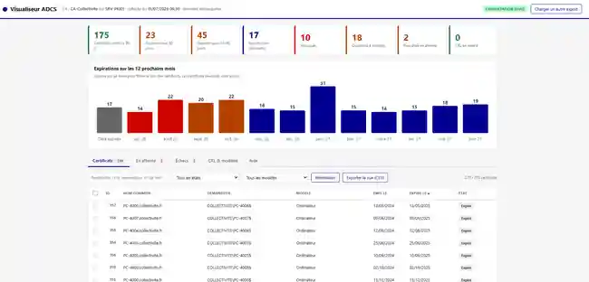
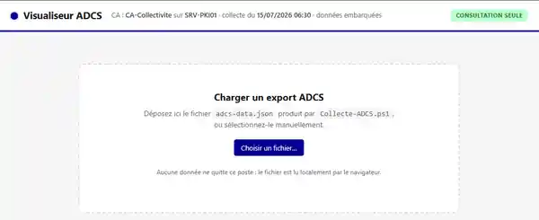
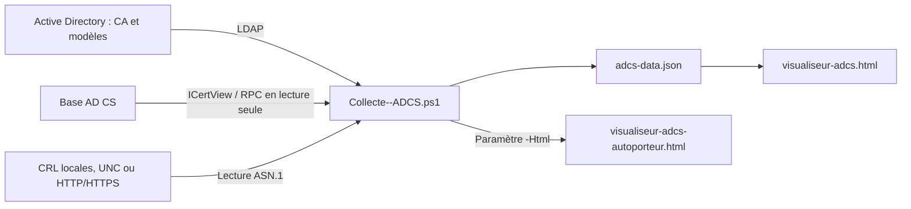

# Check-ADCS

[](https://learn.microsoft.com/powershell/)
[](LICENSE)

**Check-ADCS** est un outil de consultation et de supervision d’une autorité de certification Microsoft **Active Directory Certificate Services (AD CS)**.

Le projet associe :

- un collecteur PowerShell qui interroge la base de la CA en **lecture seule** ;
- un visualiseur HTML autonome, utilisable localement sans serveur web ni dépendance externe ;
- la génération facultative d’un fichier HTML autoporteur contenant directement les données collectées.

> Check-ADCS ne modifie pas la CA. Les opérations sensibles éventuellement préparées par le visualiseur, comme les révocations, restent à relire puis à exécuter volontairement par un administrateur habilité.

## Aperçu

### Tableau de bord avec données embarquées

[](images/visualiseur-adcs-tableau.webp)

Le tableau de bord synthétise l’état des certificats, les prochaines expirations, les révocations, les doublons potentiels, les requêtes en attente et la santé des CRL.

### Chargement manuel d’un export JSON

[](images/visualiseur-adcs-import.webp)

En mode JSON séparé, le fichier `adcs-data.json` est sélectionné ou déposé dans le navigateur. Son contenu reste traité localement.

## Aperçu fonctionnel

Le visualiseur fournit notamment :

- des indicateurs de synthèse sur les certificats actifs, expirés, bientôt expirés et révoqués ;
- une frise des expirations sur les douze prochains mois ;
- la recherche, le tri et le filtrage par état ou modèle de certificat ;
- le détail des certificats émis et révoqués ;
- le suivi des demandes en attente ;
- l’analyse des demandes refusées ou en erreur ;
- l’état des CRL et l’alerte sur les prochaines dates de publication ;
- l’inventaire des modèles de certificats publiés dans Active Directory ;
- la détection d’anciens certificats potentiellement en doublon ;
- l’export CSV des vues filtrées ;
- la préparation de commandes `certutil` et de scripts PowerShell de révocation ;
- un fonctionnement hors ligne : les données sont traitées localement par le navigateur.

La détection des doublons recherche un certificat plus récent et valide possédant le même nom commun et le même modèle. Les certificats dont la durée de validité est inférieure ou égale à 60 jours sont exclus afin de ne pas signaler comme anormaux certains chevauchements légitimes, notamment pour OCSP.

## Architecture



Le collecteur utilise l’interface COM native `CertificateAuthority.View` (`ICertView`). Aucun module PowerShell tiers, tel que PSPKI, n’est nécessaire.

## Données collectées

Le fichier JSON contient :

- les certificats émis et révoqués ;
- les identifiants de requête, noms communs, demandeurs, numéros de série et dates de validité ;
- le modèle de certificat associé ;
- les dates et motifs de révocation ;
- les demandes en attente ;
- les demandes refusées ou en erreur et leur message de disposition ;
- les modèles publiés dans Active Directory ;
- les dates `thisUpdate` et `nextUpdate` des CRL ;
- les métadonnées de collecte : CA, serveur, date de génération, durée et nombre de lignes lues.

## Prérequis

### Poste de collecte

- Windows avec **Windows PowerShell 5.1** ou **PowerShell 7+** ;
- accès à un domaine Active Directory contenant la CA d’entreprise ;
- disponibilité du composant COM `CertificateAuthority.View` ;
- accès RPC à l’autorité de certification ;
- accès LDAP à Active Directory pour l’auto-détection de la CA et la résolution des modèles ;
- accès aux CRL par partage UNC, fichier local ou URL HTTP(S).

PowerShell 7 ou supérieur est recommandé pour les bases volumineuses. Sous Windows PowerShell 5.1, le script utilise `JavaScriptSerializer` lorsque celui-ci est disponible afin d’éviter les mauvaises performances de `ConvertTo-Json` sur de gros volumes.

### Droits

Utilisez un compte dédié possédant uniquement :

- le droit **Read** sur l’autorité de certification ;
- ou le rôle **Auditor** lorsque la séparation des rôles AD CS est activée ;
- les droits de lecture nécessaires dans Active Directory et sur les fichiers CRL.

L’utilisation d’un compte administrateur de la CA pour la collecte est déconseillée.

## Installation

```powershell
git clone https://github.com/IiscsiI/Check-ADCS.git
Set-Location .\Check-ADCS
```

Le fichier du dépôt est actuellement nommé `Collecte--ADCS.ps1`, avec deux tirets entre `Collecte` et `ADCS`. Les exemples ci-dessous reprennent ce nom exact.

## Utilisation rapide

### 1. Collecte avec auto-détection

```powershell
.\Collecte--ADCS.ps1
```

Le script recherche les CA d’entreprise publiées dans Active Directory. Si plusieurs CA sont trouvées, il utilise la première et affiche un avertissement. Pour éviter toute ambiguïté, précisez explicitement `-Config` en production.

Le résultat est écrit dans le dossier courant :

```text
adcs-data.json
```

### 2. Cibler une CA précise

```powershell
.\Collecte--ADCS.ps1 `
    -Config 'SRV-PKI01\CA-Collectivite' `
    -Sortie '.\export'
```

Le format attendu pour `-Config` est :

```text
SERVEUR\Nom de la CA
```

### 3. Limiter l’historique

Sur une base volumineuse, limitez la collecte aux requêtes soumises depuis une date donnée :

```powershell
.\Collecte--ADCS.ps1 `
    -Config 'SRV-PKI01\CA-Collectivite' `
    -Depuis (Get-Date).AddYears(-3) `
    -Sortie '.\export'
```

La restriction est appliquée côté serveur sur le champ `Request.SubmittedWhen`.

### 4. Générer le visualiseur autoporteur

```powershell
.\Collecte--ADCS.ps1 `
    -Config 'SRV-PKI01\CA-Collectivite' `
    -Html '.\visualiseur-adcs.html' `
    -Sortie '.\export'
```

Deux fichiers sont alors produits :

```text
export\adcs-data.json
export\visualiseur-adcs-autoporteur.html
```

Le fichier autoporteur embarque le JSON dans la page HTML. Il peut être ouvert directement dans un navigateur moderne ou déposé sur un partage interne protégé.

### 5. Lire les CRL depuis un CDP HTTP(S)

```powershell
.\Collecte--ADCS.ps1 `
    -Config 'SRV-PKI01\CA-Collectivite' `
    -CheminCRL 'https://pki.example/CertEnroll/CA-Collectivite.crl' `
    -AlerteCRLHeures 48 `
    -Html '.\visualiseur-adcs.html' `
    -Sortie '.\export'
```

Plusieurs CRL peuvent être fournies :

```powershell
-CheminCRL @(
    '\\SRV-PKI01\CertEnroll\CA-Collectivite.crl',
    '\\SRV-PKI01\CertEnroll\CA-Collectivite+.crl'
)
```

Sans `-CheminCRL`, le script recherche automatiquement les fichiers `*.crl` dans :

```text
\\<serveur-de-la-CA>\CertEnroll
```

La lecture des dates de CRL est réalisée directement dans leur structure ASN.1. Le collecteur n’utilise pas `certutil -crl`, car cette commande provoquerait une nouvelle publication de CRL.

## Paramètres du collecteur

La liste ci-dessous reprend exclusivement le bloc `param()` présent dans `Collecte--ADCS.ps1`. Le script ne déclare aucun autre paramètre.

| Paramètre | Type | Obligatoire | Description |
|---|---:|:---:|---|
| `-Config` | `String` | Non | CA cible au format `SERVEUR\Nom de la CA`. Auto-détection si omis. |
| `-Depuis` | `DateTime` | Non | Restreint côté serveur la collecte aux requêtes soumises depuis cette date. |
| `-Sortie` | `String` | Non | Dossier de sortie. Valeur par défaut : dossier courant (`.`). |
| `-CheminCRL` | `String[]` | Non | Chemins locaux, UNC ou URL HTTP(S) des CRL. |
| `-Html` | `String` | Non | Chemin du visualiseur servant de modèle pour produire le fichier autoporteur. |
| `-AlerteCRLHeures` | `Int32` | Non | Marge avant `nextUpdate` déclenchant l’état « à surveiller ». Valeur par défaut : 24 heures. |

## Utilisation du visualiseur

### Mode JSON séparé

1. Ouvrez `visualiseur-adcs.html` dans un navigateur moderne.
2. Glissez-déposez `adcs-data.json` dans la zone d’import ou utilisez **Choisir un fichier**.
3. Consultez les indicateurs et les différents onglets.

Le fichier est lu localement par le navigateur. Aucune donnée n’est envoyée vers un serveur par le visualiseur.

### Mode autoporteur

Ouvrez simplement :

```text
visualiseur-adcs-autoporteur.html
```

Les données sont déjà embarquées dans la page.

### Préparation des révocations

Le visualiseur peut préparer :

- des commandes `certutil` de révocation ;
- une liste de numéros de série ;
- un script PowerShell de révocation en masse avec confirmation explicite, transcript et bilan d’exécution.

Ces éléments ne sont jamais exécutés automatiquement. Ils doivent être relus, idéalement signés, puis lancés depuis un poste d’administration avec un compte autorisé.

Après une révocation, une nouvelle CRL doit être publiée selon la procédure d’exploitation de la PKI afin que les clients disposent rapidement de l’information.

## Planification recommandée

La collecte peut être lancée quotidiennement par une tâche planifiée avec un compte de service dédié en lecture seule.

Exemple d’action :

```text
Programme : C:\Program Files\PowerShell\7\pwsh.exe
Arguments : -NoProfile -File "C:\Outils\Check-ADCS\Collecte--ADCS.ps1" -Config "SRV-PKI01\CA-Collectivite" -Html "C:\Outils\Check-ADCS\visualiseur-adcs.html" -Sortie "\\SERVEUR\Partage\PKI"
```

Dans cet exemple, `-NoProfile` et `-File` sont des options de l’exécutable `pwsh.exe`. Les paramètres transmis à `Collecte--ADCS.ps1` sont uniquement `-Config`, `-Html` et `-Sortie`.

Protégez le compte de service, le répertoire de sortie et l’historique des exports conformément à la sensibilité des informations de la PKI.

## Sécurité et limites

- Le collecteur réalise uniquement des lectures sur la base AD CS, Active Directory et les fichiers CRL.
- Le visualiseur ne se connecte pas à la CA et ne contient aucune dépendance JavaScript distante.
- Le JSON et le HTML autoporteur contiennent un inventaire potentiellement sensible : noms communs, demandeurs, modèles, numéros de série, erreurs et historique de révocation.
- Le fichier autoporteur doit être protégé comme le JSON source, puisque les données y sont intégrées en clair.
- Les résultats constituent un **instantané** au moment de la collecte, pas une supervision temps réel.
- L’auto-détection ne doit pas être utilisée sans contrôle lorsqu’un domaine publie plusieurs CA.
- La détection de doublons est une aide à l’analyse. Elle ne prouve pas que l’ancien certificat n’est plus utilisé.
- Une révocation est généralement définitive, sauf suspension avec le motif `certificateHold` dans les conditions prévues par AD CS.
- Vérifiez toujours le déploiement du certificat de remplacement avant de révoquer un ancien certificat.

## Structure du dépôt

```text
Check-ADCS/
├── Collecte--ADCS.ps1       # Collecteur AD CS en lecture seule
├── visualiseur-adcs.html    # Interface HTML hors ligne
├── images/                  # Captures affichées dans le README
│   ├── visualiseur-adcs-tableau.webp
│   └── visualiseur-adcs-import.webp
├── LICENSE                  # GNU General Public License v3
└── README.md
```

## Licence

Ce projet est distribué sous licence **GNU General Public License v3.0**. Consultez le fichier [LICENSE](LICENSE) pour les conditions complètes.

## Avertissement

Ce projet est fourni sans garantie. Testez son fonctionnement et les commandes générées dans un environnement maîtrisé avant toute utilisation sur une infrastructure de production.